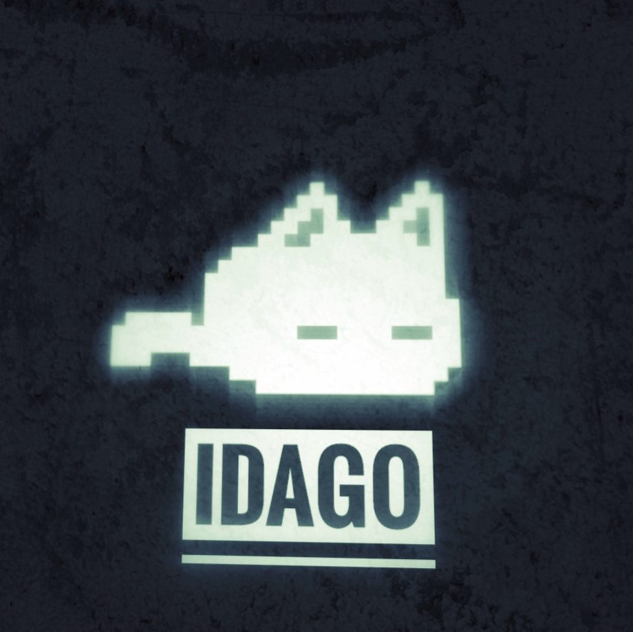

# `☆▪︎▪︎ The Nerrito - 𝙱𝚘𝚝 🐈‍⬛ ▪︎▪︎☆`

<p align="center">
 
 <h2 align="center">Nerrito-Bot-MD</h2>
 <p align="center">Un chatbot automatizado para WhatsApp basado en Node.js, que permite realizar múltiples funciones y personalizaciones en la plataforma.</p>
</p>

## <a href="https://github.com/IDAGO-OG/Nerrito-Bot-MD"></a>

<p align="center">
  <a href="https://api.whatsapp.com/send?phone=+584121275155&text=&text=.menu">Demo</a>
</p>

<!-- <p align="center">
  <a href="/src/docs/README_en.md">English</a>
  ·
  <a href="/src/docs/README_pt-br.md">Português</a>
</p> -->

# Avisos Importantes

<p align="center">   
<a href="https://github.com/IDAGO-OG/Nerrito-Bot-MD/watchers"></a>
<a href="https://github.com/IDAGO-OG/Nerrito-Bot-MD/stargazers"></a>
</p>

<div align="center">
 
[](mailto:D32393844@gmail.com)
[](https://wa.me/qr/4CPY3MTWUGEKH1)
[](https://www.facebook.com/share/18uhJ1qmBE/)
[](https://instagram.com/_1dago)
</div>

> [!IMPORTANT]\
> Este proyecto **no está afiliado de ninguna manera** con `WhatsApp`, `Inc. WhatsApp` es una marca registrada de `WhatsApp LLC`, y este bot es un **desarrollo independiente** que **no tiene ninguna relación oficial con la compañía**.

-----
### 🐈‍⬛ INSTALACIÓN MANUAL POR TERMUX - GITHUB 
<details>
  <summary><b>Toca para ver más.</b></summary>
 
> *Comandos para instalar de forma manual*
```bash
termux-setup-storage
```
```bash
apt update && apt upgrade && pkg install -y git nodejs ffmpeg imagemagick yarn
```
```bash
git clone https://github.com/IDAGO-OG/Nerrito-Bot-MD && cd Nerrito-Bot-MD
```
```bash
yarn install && npm install
```
```bash
npm start
```
> *Si aparece **(Y/I/N/O/D/Z) [default=N] ?** use la letra **"y" + "ENTER"** para continuar con la instalación*
</details>

----

</details>

-----
### 🐈‍⬛ INSTALACIÓN AUTOMÁTICA POR TERMUX - GITHUB 
<details>
  <summary><b>Toca para ver más.</b></summary>
 
> *Comando para instalar de forma Automática*
```bash
termux-setup-storage && apt update && apt upgrade -y && pkg install -y git nodejs ffmpeg imagemagick yarn && git clone https://github.com/IDAGO-OG/Nerrito-Bot-MD && cd Nerrito-Bot-MD && yarn install && npm install && npm start
```
> *Si aparece **(Y/I/N/O/D/Z) [default=N] ?** use la letra **"y" + "ENTER"** para continuar con la instalación*
</details>

----
 
## ▪︎▪︎▪︎☆ Despliegue en Otros

En esta sección encontrarás **botones de despliegue** que te permitirán implementar el proyecto en distintos entornos con un solo clic. Este proceso es **automático** y no requiere configuraciones manuales adicionales. Simplemente selecciona la plataforma deseada y haz clic en el botón correspondiente para **desplegar** tu proyecto de manera rápida y sencilla.

[](https://github.com/codespaces/new?skip_quickstart=true&machine=basicLinux32gb&repo=514876515&ref=master&geo=EuropeWest)
[](https://glitch.com/edit/#!/import/github/BrunoSobrino/TheMystic-Bot-MD)
[](https://www.heroku.com/deploy?template=https://github.com/BrunoSobrino/TheMystic-Bot-MD)
[](https://app.koyeb.com/deploy?type=git&name=themystic-bot-md&repository=https://github.com/BrunoSobrino/TheMystic-Bot-MD)
[](https://repl.it/github/BrunoSobrino/TheMystic-Bot-MD)
[](https://dashboard.render.com/blueprint/new?repo=https://github.com/BrunoSobrino/TheMystic-Bot-MD)
[](https://brunosobrino.github.io/TheMystic-Bot-MD/)
[](https://IDAGO-OG.github.io/Nerrito-Bot-MD/)
[](https://IDAGO-OG.github.io/Nerrito-Bot-MD/)

<!-- [](https://vercel.com/new/clone?repository-url=https://github.com/IDAGO-OG/Nerrito-Bot-MD) -->

# Soporte y Comunidad

## Comunidades de Ayuda

En este espacio podrás encontrar diversas **comunidades de ayuda** donde podrás **resolver tus dudas**, **compartir experiencias** y **colaborar** con otros usuarios. Únete a la comunidad que mejor se adapte a tus necesidades y forma parte de un **entorno de apoyo mutuo**.

</table>

## ▪︎▪︎☆ Desarollador Principal

Conoce a al **Desarrollador** que ha aportado al desarrollo de este proyecto. Su aporte ha sido clave para **mejorar** y **expandir** las funcionalidades del proyecto.

<a href="https://github.com/IDAGO-OG/Nerrito-Bot-MD//graphs/contributors">   
</a>

#### `NerritoBot-MD ~ By Diego-OG`
```